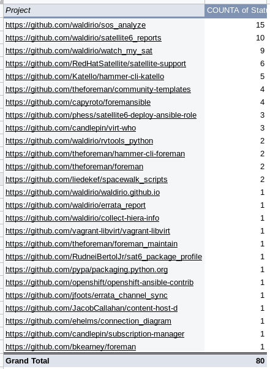

# pr_report or Pull Request Report

If you would like to easily get an report about your PR's, this is the best way to get in there. In order to run this code, will be necessary:
- Create your own virtual environment on python 3+ (I really recommend that)
```
[wpinheir@ironman ~]$ virtualenv -p python3 ~/.virtualenvs/pr_report_upstream
Running virtualenv with interpreter /usr/bin/python3
Using base prefix '/usr'
New python executable in /home/wpinheir/.virtualenvs/pr_report_upstream/bin/python3
Also creating executable in /home/wpinheir/.virtualenvs/pr_report_upstream/bin/python
Installing setuptools, pip, wheel...done.
[wpinheir@ironman ~]$

[wpinheir@ironman ~]$ workon pr_report_upstream
(pr_report_upstream) [wpinheir@ironman ~]$ python --version
Python 3.7.5

(pr_report_upstream) [wpinheir@ironman ~]$ which python
~/.virtualenvs/pr_report_upstream/bin/python
(pr_report_upstream) [wpinheir@ironman ~]$
```
- Clone the project and install the required python modules (based on `requirements.txt`)
```
(pr_report_upstream) [wpinheir@ironman ~]$ mkdir upstream
(pr_report_upstream) [wpinheir@ironman ~]$ cd upstream/

(pr_report_upstream) [wpinheir@ironman upstream]$ git clone git@github.com:waldirio/pr_report.git
Cloning into 'pr_report'...
remote: Enumerating objects: 5, done.
remote: Counting objects: 100% (5/5), done.
remote: Compressing objects: 100% (4/4), done.
remote: Total 5 (delta 0), reused 5 (delta 0), pack-reused 0
Receiving objects: 100% (5/5), done.

(pr_report_upstream) [wpinheir@ironman upstream]$ ll
total 4
drwxrwxr-x. 3 wpinheir wpinheir 4096 Jan 23 23:39 pr_report

(pr_report_upstream) [wpinheir@ironman upstream]$ cd pr_report/

(pr_report_upstream) [wpinheir@ironman pr_report]$ ll
total 12
-rwxrwxr-x. 1 wpinheir wpinheir 3241 Jan 23 23:39 pr_report.py
-rw-rw-r--. 1 wpinheir wpinheir   12 Jan 23 23:39 README.md
-rw-rw-r--. 1 wpinheir wpinheir  342 Jan 23 23:39 requirements.txt
(pr_report_upstream) [wpinheir@ironman pr_report]$

(pr_report_upstream) [wpinheir@ironman pr_report]$ pip list
Package    Version
---------- -------
pip        20.0.1 
setuptools 45.1.0 
wheel      0.33.6 
(pr_report_upstream) [wpinheir@ironman pr_report]$

(pr_report_upstream) [wpinheir@ironman pr_report]$ pip install -r requirements.txt 
Collecting astroid==2.3.3
  Using cached astroid-2.3.3-py3-none-any.whl (205 kB)
Collecting certifi==2019.11.28
  Using cached certifi-2019.11.28-py2.py3-none-any.whl (156 kB)
  ...
Requirement already satisfied: setuptools in /home/wpinheir/.virtualenvs/pr_report_upstream/lib/python3.7/site-packages (from get==2019.4.13->-r requirements.txt (line 6)) (45.1.0)
Installing collected packages: wrapt, typed-ast, lazy-object-proxy, six, astroid, certifi, chardet, entrypoints, pycodestyle, pyflakes, mccabe, flake8, public, query-string, get, idna, isort, post, pylint, urllib3, requests
Successfully installed astroid-2.3.3 certifi-2019.11.28 chardet-3.0.4 entrypoints-0.3 flake8-3.7.9 get-2019.4.13 idna-2.8 isort-4.3.21 lazy-object-proxy-1.4.3 mccabe-0.6.1 post-2019.4.13 public-2019.4.13 pycodestyle-2.5.0 pyflakes-2.1.1 pylint-2.4.4 query-string-2019.4.13 requests-2.22.0 six-1.14.0 typed-ast-1.4.1 urllib3-1.25.8 wrapt-1.11.2
(pr_report_upstream) [wpinheir@ironman pr_report]$

(pr_report_upstream) [wpinheir@ironman pr_report]$ pip list
Package           Version   
----------------- ----------
astroid           2.3.3     
certifi           2019.11.28
chardet           3.0.4     
entrypoints       0.3       
flake8            3.7.9     
get               2019.4.13 
idna              2.8       
isort             4.3.21    
lazy-object-proxy 1.4.3     
mccabe            0.6.1     
pip               20.0.1    
post              2019.4.13 
public            2019.4.13 
pycodestyle       2.5.0     
pyflakes          2.1.1     
pylint            2.4.4     
query-string      2019.4.13 
requests          2.22.0    
setuptools        45.1.0    
six               1.14.0    
typed-ast         1.4.1     
urllib3           1.25.8    
wheel             0.33.6    
wrapt             1.11.2    
(pr_report_upstream) [wpinheir@ironman pr_report]$
```
- Create your own TOKEN on github page
  - Just follow the steps based on this [github page](https://help.github.com/en/github/authenticating-to-github/creating-a-personal-access-token-for-the-command-line)

After getting your `TOKEN`, let's do it. You can edit the file `pr_report.py` and change the line below accordingly
```
TOKEN = "YOUR_GITHUB_TOKEN_HERE"
```
or if you would like to automate, let's suppose your `TOKEN` is `asfaf315252435fsadsafdsg4325435`, then you can
```
(pr_report_upstream) [wpinheir@ironman pr_report]$ grep ^TOKEN pr_report.py 
TOKEN = "YOUR_GITHUB_TOKEN_HERE"

(pr_report_upstream) [wpinheir@ironman pr_report]$ sed -i 's/YOUR_GITHUB_TOKEN_HERE/asfaf315252435fsadsafdsg4325435/g' pr_report.py 

(pr_report_upstream) [wpinheir@ironman pr_report]$ grep ^TOKEN pr_report.py 
TOKEN = "asfaf315252435fsadsafdsg4325435"
(pr_report_upstream) [wpinheir@ironman pr_report]$
```

After that, you will be ready to go.
```
(pr_report_upstream) [wpinheir@ironman pr_report]$ ./pr_report.py 
Total number of PR's: 81, let's iterate 0 times
Saving in file file.csv.

(pr_report_upstream) [wpinheir@ironman pr_report]$ head -n10 file.csv 
Closed,Closed At,Created At,Upstream URL,State,PR
True,2014-10-31T09:29:50Z,2014-10-23T04:41:26Z,https://github.com/liedekef/spacewalk_scripts,CLOSED,https://github.com/liedekef/spacewalk_scripts/pull/19
True,2014-11-07T13:51:12Z,2014-11-07T04:47:07Z,https://github.com/liedekef/spacewalk_scripts,MERGED,https://github.com/liedekef/spacewalk_scripts/pull/21
True,2016-03-01T07:22:01Z,2015-10-07T05:31:09Z,https://github.com/bkearney/foreman,CLOSED,https://github.com/bkearney/foreman/pull/1
True,2016-07-29T14:28:48Z,2016-07-29T08:45:50Z,https://github.com/jfoots/errata_channel_sync,MERGED,https://github.com/jfoots/errata_channel_sync/pull/1
True,2017-01-11T08:37:34Z,2017-01-11T02:50:45Z,https://github.com/theforeman/foreman,CLOSED,https://github.com/theforeman/foreman/pull/4174
True,2017-03-20T07:38:09Z,2017-03-20T07:30:03Z,https://github.com/vagrant-libvirt/vagrant-libvirt,MERGED,https://github.com/vagrant-libvirt/vagrant-libvirt/pull/749
True,2017-12-10T10:09:09Z,2017-12-10T09:33:57Z,https://github.com/capyroto/foremansible,MERGED,https://github.com/capyroto/foremansible/pull/8
True,2017-12-11T08:48:17Z,2017-12-11T03:24:09Z,https://github.com/capyroto/foremansible,MERGED,https://github.com/capyroto/foremansible/pull/12
True,2017-12-11T09:22:47Z,2017-12-11T07:57:52Z,https://github.com/capyroto/foremansible,MERGED,https://github.com/capyroto/foremansible/pull/15
(pr_report_upstream) [wpinheir@ironman pr_report]$
```

At this time, you will be good to go and import this data on LibreOffice, Google Spreadsheet or MS Excel, then create your own Pivot Table and generate nice analisys based on that.




Hope you enjoy it.


See you around!

Waldirio
